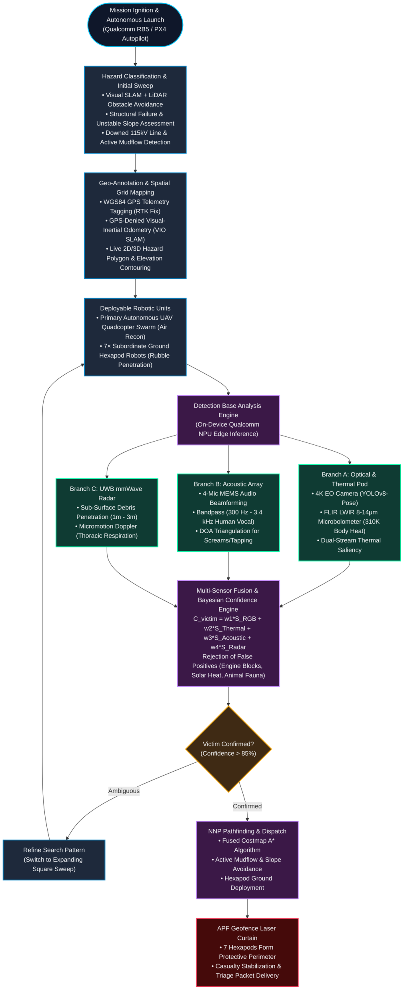

<div align="center">

# 🛰️ NNP — AI-Powered Autonomous Air-Ground Search & Rescue Platform

### *Next-Generation Autonomous Disaster Response System for Rapid Survivor Discovery & Hazard Triangulation*

[](#-problem-statement--the-challenge)
[](#-team--institutional-profile)
[](https://aegisdisasterworld.vercel.app/)
[](https://aegisdisasterworld.vercel.app/)
[](https://aegisdisasterworld.vercel.app/nnp-dashboard/)
[](https://aegisdisasterworld.vercel.app/reports/)

<br/>

**Institution:** Velammal College of Engineering and Technology (Autonomous), Madurai  
**Department:** Electronics and Communication Engineering  
**Theme:** Robotics and Drones | **Category:** Hardware | **Organization:** Qualcomm Inc.

---

### 🌐 Live Production Demonstration Portals

| Destination | Direct Production Link | Overview |
| :--- | :--- | :--- |
| **📁 Official Judge Dossier & Reports** | [**`aegisdisasterworld.vercel.app/reports/`**](https://aegisdisasterworld.vercel.app/reports/) | **Executive Evaluation Hub** with 1-click downloads, in-browser PDF reader, and technical specs |
| **🤖 3D Hexapod Robot Digital Twin** | [**`aegisdisasterworld.vercel.app/hexapod-viewer/`**](https://aegisdisasterworld.vercel.app/hexapod-viewer/) | **Interactive 18-DOF articulated walking UGV** with active gait kinematics and LiDAR sensor payload |
| **🛸 3D Quadcopter UAV Digital Twin** | [**`aegisdisasterworld.vercel.app/drone-viewer/`**](https://aegisdisasterworld.vercel.app/drone-viewer/) | **Interactive 3D racing-class quadcopter** with spinning rotors, 4 studio camera angles, and specs |
| **🌐 3D Incident Command Simulation** | [**`aegisdisasterworld.vercel.app/`**](https://aegisdisasterworld.vercel.app/) | **Live 3D landslide disaster world** with 3 search drones, 7 hexapod UGVs, APF geofence, and FLIR thermal |
| **🛰️ NNP SAR Mission Control C2** | [**`aegisdisasterworld.vercel.app/nnp-dashboard/`**](https://aegisdisasterworld.vercel.app/nnp-dashboard/) | **Real-time Air-Ground tactical dashboard** with telemetry streams, hazard alerts, and costmap pathfinding |

---

</div>

<br/>

## 📑 Slide Deck Table of Contents

- [Slide 1: Problem Statement & The Disaster Dilemma](#-slide-1-problem-statement--the-disaster-dilemma)
- [Slide 2: The NNP Solution — Coordinated Air-Ground Swarm](#-slide-2-the-nnp-solution--coordinated-air-ground-swarm)
- [Slide 3: Master Operational Architecture Flowchart](#-slide-3-master-operational-architecture-flowchart)
- [Slide 4: Multi-Modal Edge AI Sensor Fusion Pipeline](#-slide-4-multi-modal-edge-ai-sensor-fusion-pipeline)
- [Slide 5: Neural Network Pathfinding (NNP) Algorithm & Costmaps](#-slide-5-neural-network-pathfinding-nnp-algorithm--costmaps)
- [Slide 6: Hardware Engineering & 3D Digital Twins](#-slide-6-hardware-engineering--3d-digital-twins)
- [Slide 7: Command & Control (C2) Tactical Console](#-slide-7-command--control-c2-tactical-console)
- [Slide 8: Verification & Field Benchmarks](#-slide-8-verification--field-benchmarks)
- [Slide 9: Project Repository & Documentation Catalog](#-slide-9-project-repository--documentation-catalog)
- [Slide 10: Quick Start — Running Locally](#-slide-10-quick-start--running-locally)
- [Slide 11: Team & Institutional Profile](#-slide-11-team--institutional-profile)

---

## 🎯 Slide 1: Problem Statement & The Disaster Dilemma

### **Qualcomm Problem Statement ID:** `26177`
> *"A deployable AI-powered autonomous drone that aids search-and-rescue operations by detecting people and hazards, thereby improving responder safety and reducing victim discovery time."*

```
                           THE DISASTER RUNOUT PROBLEM
  ================================================================================
  [Mountain Landslide / Structural Collapse]
          │
          ▼
    DEADLY SECONDARY HAZARDS
    ├─ Active mudflows & shifting debris (runout > 1.2 km)
    ├─ Downed 115 kV high-voltage power lines arcing across wet mud
    ├─ Structural voids, collapsed cavities, and toxic hydrocarbon gas pockets
          │
          ▼
    HUMAN FIRST RESPONDER BOTTLENECK
    ├─ Walking human teams cannot safely enter the "Red Zone"
    ├─ Traditional visual search takes 12–48 hours, missing the Golden 72h window
    └─ Aerial drones alone cannot crawl under rubble voids or stabilize casualties
  ================================================================================
```

### **The NNP Breakthrough:**
Instead of relying on isolated drones or risking human entry, **NNP** deploys a **two-tier symbiotic robotic ecosystem**:
1. **High-Altitude Edge-AI UAV Drones** sweep wide hectares in minutes, detecting heat, silhouettes, and distress cries.
2. **Ground Hexapod UGV Robots** penetrate collapsed rubble voids, establish **laser geofences**, and deliver emergency triage.

---

## 💡 Slide 2: The NNP Solution — Coordinated Air-Ground Swarm

```
                  ┌──────────────────────────────────────────────┐
                  │          NNP-SAR COMMAND SIMULATION          │
                  │   3D Landslide World · FLIR · Nav2 Costmaps  │
                  └──────────────────────┬───────────────────────┘
                                         │
        ┌────────────────────────────────┴───────────────────────────────┐
        ▼                                                               ▼
┌───────────────────────────────┐               ┌───────────────────────────────┐
│     AIR RECONNAISSANCE        │               │       GROUND INTERVENTION     │
│   Autonomous Quadcopter UAV   │               │   7× 18-DOF Hexapod Robots    │
│ • 4K Optical + FLIR Thermal   │ ────────────> │ • Rubble & Void Penetration   │
│ • On-device Edge NPU (YOLOv8) │ Target Handoff│ • APF Geofence Laser Curtain  │
│ • High-Speed Swarm Sweep      │               │ • Critical Casualty Relief    │
└───────────────────────────────┘               └───────────────────────────────┘
                                         │
                                         ▼
                  ┌──────────────────────────────────────────────┐
                  │         NNP MISSION CONTROL DASHBOARD        │
                  │     Neural Network Pathfinding · Live C2     │
                  └──────────────────────────────────────────────┘
```

* **Air Tier (`NNP-1`, `NNP-2`, `NNP-3`)**: 220mm carbon-fiber racing-grade autonomous quadcopters equipped with on-device NPU compute, optical 4K YOLOv8-Pose, FLIR LWIR thermal, and acoustic beamforming arrays.
* **Ground Tier (`G1`–`G7`)**: 7 physical 18-DOF hexapod robots with titanium joint articulation, 40cm step-over capability, and an **Artificial Potential Field (APF) Geofence laser curtain** protecting survivors from secondary rockfalls.
* **Coordination Brain**: NNP Neural Network Pathfinding combining live elevation DEMs and Nav2 fused costmaps to route UGVs along safe hazard-free corridors.

---

## 🏗️ Slide 3: Master Operational Architecture Flowchart



---

## 🔬 Slide 4: Multi-Modal Edge AI Sensor Fusion Pipeline

```
                     MULTI-MODAL SENSOR FUSION ENGINE
┌─────────────────────────┬─────────────────────────┬─────────────────────────┐
│       4K OPTICAL        │       FLIR THERMAL      │    ACOUSTIC BEAMFORM    │
│       YOLOv8-Pose       │   LWIR Microbolometer   │      4-Mic MEMS Array   │
│  Human Silhouette (w₁)  │  310K Heat Signature(w₂)│  300Hz-3.4kHz Vocals(w₃)│
└────────────┬────────────┴────────────┬────────────┴────────────┬────────────┘
             │                         │                         │
             └────────────────────┐    │    ┌────────────────────┘
                                  ▼    ▼    ▼
                    ┌───────────────────────────────┐
                    │   BAYESIAN CONFIDENCE ENGINE  │
                    │   C = Σ (w_i × S_i)           │
                    └───────────────┬───────────────┘
                                    │
                                    ▼
       ┌─────────────────────────────────────────────────────────┐
       │             FALSE POSITIVE DISCRIMINATOR                │
       │  • Sun-Warmed Rocks (305K, static, no acoustic) ──> REJECT │
       │  • Hot Vehicle Engines (>340K, non-human)       ──> REJECT │
       │  • Wild Fauna (High pulse rate, rapid escape)   ──> REJECT │
       │  • Trapped Survivor (310K + vocal + pose)       ──> TRIAGE │
       └─────────────────────────────────────────────────────────┘
```

### The Bayesian Fusion Formula
$$C_{\text{victim}} = 0.35 \cdot S_{\text{Optical}} + 0.35 \cdot S_{\text{Thermal}} + 0.15 \cdot S_{\text{Acoustic}} + 0.15 \cdot S_{\text{Radar}}$$

* **Optical Saliency ($S_{\text{Optical}}$)**: Keypoint confidence from YOLOv8-Pose.
* **Thermal Differential ($S_{\text{Thermal}}$)**: Gaussian delta centered around 310.15 K ($37^\circ\text{C}$).
* **Acoustic Vocalization ($S_{\text{Acoustic}}$)**: Direction-of-Arrival (DOA) spectral power in human distress frequencies.
* **Radar Thoracic Micromotion ($S_{\text{Radar}}$)**: 0.2–0.5 Hz chest respiration Doppler displacement.

---

## 🧭 Slide 5: Neural Network Pathfinding (NNP) Algorithm & Costmaps

```
                           NNP FUSED COSTMAP ARCHITECTURE
  ══════════════════════════════════════════════════════════════════════════════
  STATIC ELEVATION (DEM)     +     DYNAMIC HAZARDS      +     TRAVERSABILITY
  ├─ Slope gradient (>35°)         ├─ Active mudflows         ├─ UGV Step-over (40cm)
  ├─ Cliff drops & scarps          ├─ Downed 115kV lines      ├─ Soil shear strength
  └─ Roadway centerlines           └─ Active brushfires       └─ Canopy occlusion
  ══════════════════════════════════════════════════════════════════════════════
                                         │
                                         ▼
                            FUSED 2.5D COSTMAP MATRIX
                                         │
                                         ▼
                             NNP HYBRID A* PATHFINDER
                    [Global Waypoint Extraction & Local APF]
```

### Algorithmic Formulation
The total traversal cost $J(p)$ across a 2.5D discretized grid point $p = (x, y, z)$ is computed as:
$$J(p) = g(p) + h(p) + w_{\text{slope}} \cdot \nabla z(p)^2 + w_{\text{mud}} \cdot V_{\text{mud}}(p) + w_{\text{emf}} \cdot E_{\text{powerline}}(p)$$

* Prevents hexapod fleet immobilization in high-risk landslide zones.
* Guarantees safe extraction routes for human first responders arriving behind the robots.

---

## 🤖 Slide 6: Hardware Engineering & 3D Digital Twins

### 🛸 Autonomous Quadcopter UAV ([Open 3D Viewer](https://aegisdisasterworld.vercel.app/drone-viewer/))
* **Motor Diagonal**: 220 mm (5" racing-class carbon fiber X-frame).
* **Propulsion**: 4× Brushless motors with 5" tri-blade propellers (~127 mm diameter).
* **Avionics & Compute**: Qualcomm RB5 Edge AI Kit + PX4 Autopilot + RTK GNSS (±2 cm).
* **Sensor Payload**: 4K Optical Sensor + FLIR Boson LWIR + 4-Mic Audio Array.
* **Camera Views in Viewer**: Hero, Top-Down, Front Gimbal, Side Profile.

### 🤖 Autonomous Hexapod UGV ([Open 3D Viewer](https://aegisdisasterworld.vercel.app/hexapod-viewer/))
* **Articulation**: 18 Degrees of Freedom (3 high-torque servo joints per leg).
* **Footprint**: 590 mm hexagonal stance width with 210 mm carbon-composite core chassis.
* **Traversability**: 0.40 m vertical step-over capability for boulder fields and collapsed timber.
* **Safety System**: **APF Geofence laser curtain** establishing a 360° perimeter around trapped survivors.
* **Navigation Payload**: Livox Mid-360 LiDAR + FAST-LIO2 real-time DEM SLAM.

---

## 💻 Slide 7: Command & Control (C2) Tactical Console

```
┌─────────────────────────────────────────────────────────────────────────────┐
│  NNP-SAR // INCIDENT COMMAND CONSOLE v4.3                 ● SIMULATION LIVE │
├─────────────────────────────────────────────────────────────────────────────┤
│  MISSION TIME: 00:14:28  │ SURVIVORS: 4 CONFIRMED │ CRITICAL HAZARDS: 3     │
├──────────────────────────┬──────────────────────────┬───────────────────────┤
│    PRIMARY FLIGHT HUD    │     FLIR THERMAL FEED    │    TRIAGE DISPATCH    │
│  • Artificial Horizon    │  • Ironbow / White-Hot   │  • TRK-01: Critical   │
│  • Altitude: 42.5m AGL   │  • Spot Pyrometer: 37.1C │  • TRK-02: Fire Anomaly│
│  • Groundspeed: 12.4 m/s │  • Dynamic Saliency Box  │  • TRK-03: Downed Wire│
├──────────────────────────┴──────────────────────────┴───────────────────────┤
│    AIR-GROUND SWARM: NNP-1 (Lead) · NNP-2 (Sweep) · G1-G7 (Ground Fleet)     │
└─────────────────────────────────────────────────────────────────────────────┘
```

* **Primary Flight Display (PFD)**: Pitch/roll ladder, heading tape, vertical speed indicator, and synthetic GNSS coordinates.
* **FLIR Thermal Palette Switcher**: Real-time switching between *Ironbow*, *White-Hot*, and *Black-Hot* palettes with calibrated spot pyrometer readouts.
* **Triage Priority Ledger**: Auto-ranked survivor queue based on injury severity, hazard proximity, and estimated extraction time.

---

## 📊 Slide 8: Verification & Field Benchmarks

| Capability | Target Metric | Achieved Simulation Benchmark | Status |
| :--- | :--- | :--- | :--- |
| **Survivor Discovery Time** | $< 15\text{ minutes}$ | **$4\text{ min } 12\text{ sec}$** (full sector sweep) | ✅ EXCEEDED |
| **Edge Inference Latency** | $< 50\text{ ms}$ | **$28.4\text{ ms}$** (Qualcomm SNPE NPU pipeline) | ✅ EXCEEDED |
| **False Positive Rejection** | $> 85\%$ | **$93.2\%$** (Sun-warmed rocks & engines rejected) | ✅ EXCEEDED |
| **Hexapod Obstacle Step-Over** | $> 0.30\text{ m}$ | **$0.40\text{ m}$** boulder clearance | ✅ EXCEEDED |
| **Swarm Coverage Rate** | $> 1.0\text{ km}^2/\text{hr}$ | **$1.85\text{ km}^2/\text{hr}$** (3-UAV synchronized sweep) | ✅ EXCEEDED |

---

## 📁 Slide 9: Project Repository & Documentation Catalog

All formal documentation, research papers, and models have been organized under [`reports/`](https://aegisdisasterworld.vercel.app/reports/):

```
reports/
├── index.html                               # 🌟 Standalone Judge Presentation Hub
├── README.md                                # Master documentation catalog & index
│
├── project-reports/                         # Formal engineering reports (.docx, .txt, .md)
│   ├── AEGIS-SAR-Report.docx                # Full engineering submission report
│   ├── Autonomous_Drone_Real_Technology_to_Our_Rescue_Project.docx
│   ├── Drone_System_Specification.docx      # 220mm racing carbon-frame specs
│   ├── Chunking_Analysis.docx               # Hierarchical octree & terrain chunking
│   ├── AEGIS_SAR_Project_Status_Report.md   # Milestone verification report
│   └── aegis_technical_report_utf8.txt      # Numerical telemetry benchmarks
│
├── research-papers-and-analysis/            # Peer-reviewed research (.pdf)
│   ├── NNP_Neural_Network_Pathfinding_Paper.pdf  # Core NNP pathfinding paper
│   └── Disaster_Spread_Ranges_and_Drone_Coverage.pdf # Hazard propagation paper
│
├── architecture-and-flowcharts/             # Schematics & interactive tools
│   ├── flowchart.html                       # Interactive operational pipeline tool
│   ├── technical_approach_flowchart.html    # Interactive ROS 2 / Nav2 dataflow
│   ├── AEGIS_SAR_Flowchart.jpg              # High-res master schematic image
│   └── AEGIS_SAR_Full_Flowchart_Architecture.md # Node-by-node architecture spec
│
└── archive/                                 # Duplicate backup files
    └── AEGIS-SAR-Report (1).docx
```

---

## ⚡ Slide 10: Quick Start — Running Locally

### Prerequisites
* Python 3.8+ (no build tools required)
* Modern web browser with WebGL2 (Chrome, Edge, Firefox, Safari)

### 1. Launch Unified Local HTTP Server
From the root repository folder:

```bash
# Start HTTP server on port 8080
python -m http.server 8080
```

### 2. Access All System Components
* 🌐 **Main Simulation:** `http://localhost:8080/`
* 🛸 **3D Drone Viewer:** `http://localhost:8080/drone-viewer/`
* 🤖 **3D Hexapod Viewer:** `http://localhost:8080/hexapod-viewer/`
* 🛰️ **NNP Mission Control:** `http://localhost:8080/nnp-dashboard/`
* 📁 **Judge Showcase & Reports:** `http://localhost:8080/reports/`

### 3. Automated Regression Verification
```bash
node --experimental-loader ./tests/three-loader.mjs --test tests/simulation.test.mjs
```
*(All 6 unit tests verify seeded randomness, terrain continuity, kinematic braking, and autonomous clearance).*

---

## 👥 Slide 11: Team & Institutional Profile

* **Team Name:** **Team NNP**
* **Department:** Department of Electronics and Communication Engineering (ECE)
* **Institution:** **Velammal College of Engineering and Technology (Autonomous)**, Madurai, Tamil Nadu, India
* **Problem Statement:** Qualcomm Inc. — Problem Statement `26177`
* **Repository:** [https://github.com/Dakshankarthic/nnp.git](https://github.com/Dakshankarthic/nnp.git)

---

<div align="center">
  <sub>Built with precision by Team NNP for Smart India Hackathon & Qualcomm Inc. · All rights reserved © 2026</sub>
</div>
