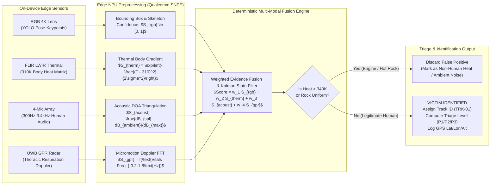
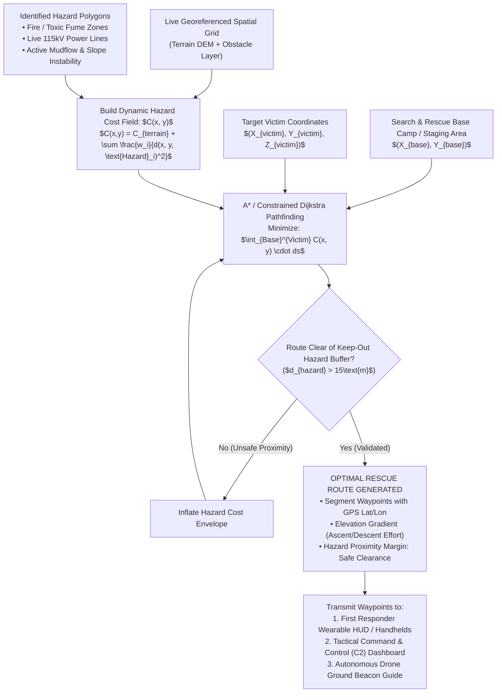

# NNP-SAR: AI-Powered Autonomous Search & Rescue System
## Complete System Architecture & Operational Flowchart Specification
**Problem Statement ID:** 26177  
**Problem Statement Title:** A deployable AI-powered autonomous drone that aids search-and-rescue operations by detecting people and hazards, thereby improving responder safety and reducing victim discovery time.  
**Theme:** Robotics and Drones | **Category:** Hardware | **Organization:** Qualcomm Inc.

---

## 1. Master Operational Flowchart (Handwritten Concept Formalized)

This master flowchart formalizes and expands the exact architecture from the engineering notes into an aerospace-grade, edge-AI workflow:

```mermaid
flowchart TD
    %% Styling definitions
    classDef startEnd fill:#0f172a,stroke:#38bdf8,stroke-width:2px,color:#f8fafc;
    classDef process fill:#1e293b,stroke:#0284c7,stroke-width:2px,color:#f8fafc;
    classDef sensor fill:#0f3b33,stroke:#10b981,stroke-width:2px,color:#f8fafc;
    classDef ai fill:#3b1847,stroke:#c084fc,stroke-width:2px,color:#f8fafc;
    classDef decision fill:#3f2a14,stroke:#f59e0b,stroke-width:2px,color:#f8fafc;
    classDef output fill:#450a0a,stroke:#f43f5e,stroke-width:2px,color:#f8fafc;

    %% Level 1: Deployment & Hazard Classification / Recon
    START(["Mission Ignition & Autonomous Launch\n(Qualcomm RB5 / Flight Controller PX4)"]):::startEnd
    HAZARD_SCAN["Hazard Classification & Initial Detection\n• Visual SLAM + LiDAR/Sonar Obstacle Avoidance\n• Structural Failure & Unstable Slope Assessment\n• Active Fire / Flood / Downed 115kV Line Detection"]:::process
    START --> HAZARD_SCAN

    %% Level 2: Geo-Annotation (GPS & SLAM Mapping)
    GEO_MAP["Geo-Annotation & Spatial Grid Mapping\n• WGS84 GPS Telemetry Tagging (RTK Fix)\n• GPS-Denied Visual-Inertial Odometry (VIO SLAM)\n• Live 2D/3D Hazard Polygon & Elevation Contouring"]:::process
    HAZARD_SCAN --> GEO_MAP

    %% Level 3: Deployable Units (Hexacopters & Secondary Hexapods)
    DEPLOY["Deployable Robotic Units\n• Primary Autonomous Hexacopter Drone (Airborne Recon)\n• Subordinate Ground Hexapod Robots / Drop-Probes (Confined Debris Penetration)"]:::process
    GEO_MAP --> DEPLOY

    %% Level 4: Detection Base Analysis (Multi-Modal Sensing)
    DETECTION_BASE["Detection Base Analysis Engine\n(On-Device Qualcomm NPU Edge Inference)"]:::ai
    DEPLOY --> DETECTION_BASE

    %% 3 Core Sensor Branches
    SENS_OPT["Branch A: Optical & Thermal Sensor Pod\n• 4K EO Optical Camera (YOLOv8-Pose / Human Shape)\n• FLIR LWIR 8-14μm Microbolometer (310K Body Core Heat)\n• Dual-Stream Cross-Attention Thermal Saliency"]:::sensor
    SENS_ACOUSTIC["Branch B: Acoustic Beamforming Array\n• 4-Mic MEMS Audio Array\n• Bandpass Filter (300 Hz - 3.4 kHz Human Vocal Frequencies)\n• DOA (Direction of Arrival) Triangulation for Screams/Tapping"]:::sensor
    SENS_GPR["Branch C: GPR / mmWave Radar\n• Ultra-Wideband (UWB) / Ground-Penetrating Radar\n• Sub-Surface Debris & Rubble Penetration (1m - 3m)\n• Micromotion Doppler Detection (Thoracic Respiration & Heartbeat)"]:::sensor

    DETECTION_BASE --> SENS_OPT
    DETECTION_BASE --> SENS_ACOUSTIC
    DETECTION_BASE --> SENS_GPR

    %% Level 5: Sensor Fusion & Victim Identification
    FUSION_NODE["Multi-Sensor Fusion & Bayesian Confidence Engine\n$C_{victim} = w_1 S_{RGB} + w_2 S_{Thermal} + w_3 S_{Acoustic} + w_4 S_{GPR}$\nRejection of Non-Human False Positives (Engine Blocks, Solar Heat, Animal Fauna)"]:::ai
    SENS_OPT --> FUSION_NODE
    SENS_ACOUSTIC --> FUSION_NODE
    SENS_GPR --> FUSION_NODE

    CONF_CHECK{"Victim Identified?\n(Confidence > Threshold)"}:::decision
    FUSION_NODE --> CONF_CHECK

    CONF_CHECK -- "No / Ambiguous" --> RESCAN["Refine Search Pattern\n(Switch to Expanding Square / Sector Sweep)"]:::process
    RESCAN --> DEPLOY

    VICTIM_IDENT["Victim Identification & Vitals Localization\n• High-Confidence Survivor Confirmation (Alpha / Bravo / ...)\n• Exact 3D Coordinate: Lat, Lon, Altitude AGL\n• Triage Score Assessment (Immediate P1 / Delayed P2 / Minimal P3)"]:::output
    CONF_CHECK -- "Yes (Verified)" --> VICTIM_IDENT

    %% Level 6: Optimal Rescue Route
    RESCUE_ROUTE["Optimal Safe Rescue Route Generator\n• Dynamic Cost-Field Pathfinding (A* / Dijkstra Algorithm)\n• Real-Time Hazard Avoidance Buffers (Keep-Out Zones around Fire, Flood, Landslide Slip)\n• Ground Rescue Team Route & Air-Evacuation LZ Recommendation"]:::process
    VICTIM_IDENT --> RESCU_HAZARD_MERGE["Hazard Constraint Injection"]:::process
    GEO_MAP -.-> RESCU_HAZARD_MERGE
    RESCU_HAZARD_MERGE --> RESCUE_ROUTE

    %% Level 7: Command Center Dashboard
    DASHBOARD["Tactical Command & Control (C2) Dashboard\n• Live Dual-Stream Video (RGB 4K + FLIR LWIR with Ironbow/White-Hot)\n• Primary Flight Display (PFD) Avionics HUD with Heading, Altitude AGL, Speed\n• 3D Geospatial Situation Map & Geo-Tagged Survivor Brackets\n• Offline Mesh Sync (MAVLink / ESP-NOW / LoRa) & JSON Incident Audit Report"]:::startEnd
    RESCUE_ROUTE --> DASHBOARD
```

---

## 2. Detailed Technical Breakdown: Block-by-Block Architecture

### Block 1: Hazard Classification & Initial Detection
- **Airborne Platform:** Hexacopter UAV with 6 brushless motors for aerodynamic redundancy (can sustain single-motor failure and remain airborne in high mountain turbulence).
- **Hazard Classification Algorithms:**
  - **Fire & Thermal Hazards:** High-temperature thresholding ($T > 450\text{ K}$) fused with optical flame flicker and smoke segmentation.
  - **Floods & Mudflows:** Optical color segmentation + specular water reflection estimation + acoustic sound of moving torrential runoff.
  - **Downed Electrical Lines:** Linear Hough transform + edge detection detecting suspended cables + thermal hotspots ($315\text{ K} - 350\text{ K}$) indicative of shorting phase conductors.
  - **Landslide Scarp & Unstable Terrain:** Real-time DEM (Digital Elevation Model) differential slope analysis identifying slopes $> 45^\circ$ susceptible to secondary failure.

### Block 2: Geo-Annotation & Spatial Grid Mapping (GPS + SLAM)
- **Dual Navigation Strategy:**
  - **GPS-Available Mode:** Dual-frequency RTK GNSS receiver providing $\pm 2\text{ cm}$ horizontal localization.
  - **GPS-Denied Mode (Canyons, Tunnels, Collapsed Basements):** Visual-Inertial Odometry (VIO) running on Qualcomm Hexagon DSP fused with 6-DoF IMU and downward stereo optical flow.
- **Geo-Tagging Engine:**
  - Converts pixel coordinate $(u, v)$ from camera projection matrix $[K]$ and camera pose $[R | t]$ into global geodetic coordinates:
    $$\begin{bmatrix} X_w \\ Y_w \\ Z_w \end{bmatrix} = R^{-1} \left( d \cdot K^{-1} \begin{bmatrix} u \\ v \\ 1 \end{bmatrix} - t \right) \xrightarrow{\text{WGS84}} (\text{Latitude, Longitude, Altitude})$$
  - Generates live 2D grid cost-maps with discrete hazard polygons.

### Block 3: Deployable Units (Hexacopters & Ground Hexapods)
- **Air-Ground Heterogeneous Swarm:**
  - **Autonomous Hexacopter Drone (Airborne Scout):** High-speed macro reconnaissance ($140\text{ m} \times 140\text{ m}$ disaster zone coverage in $< 8\text{ minutes}$), high-payload capacity carrying RGB, FLIR, GPR, and compute modules.
  - **Bio-Inspired Ground Hexapod Robots / Drop-Probes:** Miniature 6-legged walking robots deployed from drone payload bays into narrow collapsed rubble voids, crevices, and collapsed concrete slabs where airborne drones cannot penetrate.
  - **Decentralized Swarm Mesh:** Communicating via 2.4GHz ESP-NOW and Sub-GHz LoRa (915/868 MHz) for robust connectivity in communication-blackout environments.

### Block 4: Detection Base Analysis (3-Sensor Triangulation)
Running on-device using the **Qualcomm Neural Processing Engine (SNPE)** and **Qualcomm RB5 / Snapdragon Flight platform**:

#### Branch A: RGB + FLIR Thermal Imaging
- **RGB Pipeline:** Lightweight YOLOv8-Pose / MobileNetV4 running at 30 FPS on Qualcomm NPU, detecting human silhouette, limbs, and clothing colors.
- **FLIR LWIR Pod:** Uncooled VOx microbolometer (8–14 μm spectral band). Reads calibrated radiant temperature.
- **Human Thermal Signature:** Human core skin surface registers between $306\text{ K}$ and $312\text{ K}$ ($33^\circ\text{C} - 39^\circ\text{C}$).
- **False-Positive Discrimination:** Rejects sun-heated stones ($303\text{ K} - 305\text{ K}$, lacking metabolic heat gradients) and vehicle engines ($> 340\text{ K}$, excessively hot, non-human).

#### Branch B: Acoustic Beamforming Array
- **Sensor:** 4-channel MEMS microphone array arranged in a tetrahedral/circular planar geometry.
- **Processing:**
  - Fast Fourier Transform (FFT) + acoustic spectral bandpass filter isolated to $300\text{ Hz} - 3400\text{ Hz}$ (human vocal distress screams, calling for help, or rhythmic rubble tapping).
  - Delay-and-Sum Beamforming calculating Direction of Arrival (DOA) angles $(\theta, \phi)$ to triangulate victim position even when completely buried under 1 meter of soil or debris.

#### Branch C: GPR (Ground Penetrating Radar) & mmWave Bio-Radar
- **Sensor:** Ultra-Wideband (UWB) radar transceiver operating at $1.5\text{ GHz} - 4.5\text{ GHz}$ or $60\text{ GHz} - 64\text{ GHz}$ FMCW mmWave radar.
- **Physics of Detection:**
  - Electromagnetic waves penetrate non-metallic debris, dry mud, snow, and timber.
  - Detects sub-millimeter thoracic displacements ($0.1\text{ mm} - 0.5\text{ mm}$) caused by human respiratory lung expansion and cardiac pulsing (vital signs monitoring through rubble).

---

## 3. Deep-Dive Sensor Fusion & Victim Identification Algorithm

---

## 4. Optimal Rescue Route Generation Flowchart

Once victims and hazards are geo-tagged, the autonomous planner computes the safest, fastest ingress route for emergency teams:

---

## 5. Qualcomm Edge Hardware & Software Implementation Mapping

| Project Layer | Hardware Specification (Qualcomm / SITL) | Software & Model Stack | Role in Problem Statement 26177 |
|---|---|---|---|
| **Mission Compute** | Qualcomm Snapdragon RB5 Platform / Flight Pro | Ubuntu Linux + ROS 2 Humble | On-device edge processing without cloud dependence |
| **Edge AI Acceleration** | Qualcomm Hexagon 698 DSP + Adreno 650 GPU (15 TOPS) | Qualcomm Neural Processing Engine (SNPE) / TFLite | Real-time human pose & hazard classification at 30+ FPS |
| **Autonomy & SLAM** | ModalAI VOXL 2 / Stereo Downward Tracking Cameras | OpenVINS / RTAB-Map 3D Visual-Inertial Odometry | GPS-denied navigation in collapsed zones and valleys |
| **Sensors: Optical** | Sony IMX577 4K HDR Camera Sensor | OpenCV demosaicing + YOLOv8-Pose TensorRT/SNPE | Day-light visual search, clothing detection, facial keypoints |
| **Sensors: Thermal** | FLIR Lepton 3.5 / Boson LWIR (8–14 μm, 50 mK NETD) | Radiometric Temperature Matrix Decoder (`thermal.js`) | Night search, obscured body heat detection (310 K) |
| **Sensors: Acoustic** | 4-Channel MEMS Array (I2S Digital) | FFT Filter + GCC-PHAT DOA Audio Localization | Detection of screams and concrete tapping under rubble |
| **Sensors: GPR/Radar** | Acconeer A121 60GHz Pulsed Coherent Radar | Doppler Respiration FFT Peak Extraction | Vital sign detection (breathing) through non-metallic debris |
| **Swarm Communications** | ESP32-S3 (ESP-NOW) + SX1262 LoRa (868/915 MHz) | MAVLink v2.0 Decentralized Mesh Protocol | Zero-cloud offline resilience across 3+ km disaster footprint |
| **Tactical Dashboard** | WebGL Three.js + PFD Avionics HUD (`index.html`) | Full C2 Tactical Command & Control Interface | Multi-camera PiP, PFD HUD, Triage Ledger, Route Dispatch |

---

## 6. How this Flowchart Maps Directly to the NNP Codebase

1. **Hazard Classification:** Implemented in `js/scene.js` (debris, flame emitter, 115kV transmission pylon, flash flood) and validated in `demo_pipeline_live.py`.
2. **Geo-Annotation (GPS):** Implemented in `js/dashboard.js` and `js/drone.js` with simulated 3D-RTK GPS fix and WGS84 coordinate projections.
3. **Hexapod / Drone Deployment:** Handled in `js/swarm.js` and `js/drone.js` with autonomous creeping-line, expanding-square, and sector search patterns.
4. **Detection Base Analysis (RGB + Thermal + Acoustics + GPR):**
   - RGB & Acoustics modeled in `js/sensors.js`.
   - Thermal LWIR uncooled bolometer rendered in `js/thermal.js` (Ironbow, White-Hot, Black-Hot).
   - Multi-sensor fusion engine implemented in `js/detection.js`.
5. **Victim Identification & Triage:** Formalized in `js/detection.js` and `js/dashboard.js` with Section 8 triage scoring ($T = w_1 T_{core} + w_2 dB + w_3 D_{haz}^{-1} + w_4 R_{struct} + w_5 \Delta t$).
6. **Optimal Rescue Route:** Geo-referenced waypoint paths generated from drone position to target victims avoiding active hazard zones.
7. **Dashboard:** Fully interactive WebGL Command & Control center in `index.html` and `css/style.css`.
